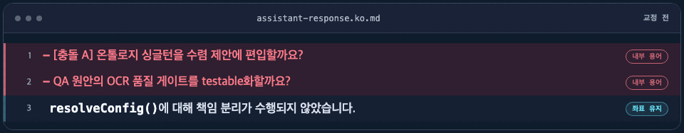

<!-- tone-lint: off (지양 예문을 담고 있어 자기 검출 제외) -->

# korean-tone

[한국어](README.md) | [English](README.en.md)

<p align="center">
  <picture>
    <source media="(prefers-reduced-motion: reduce)" srcset="assets/korean-tone-hero/korean-tone-static.png">
    
  </picture>
</p>

<p align="center">
  <strong>Make Claude sound fluent in Korean — without translating away the things you need to grep.</strong><br>
  One writing skill. One non-blocking linter. Zero renamed identifiers.
</p>

<p align="center"><code>/plugin install korean-tone@fromshim</code></p>

---

The Korean is technically correct. It still sounds translated.

korean-tone strips that stiffness from plans, implementation notes, reviews, checklists,
ADRs, and user-facing choices, while leaving code and precision alone.

## ✍️ What changes

### 1. Jargon is interpreted, not deleted

```diff
- handler가 stub이었다.
+ handler는 웹훅만 받고 저장하지 않았어요. 함수의 뼈대만 있고 실제 처리가 빠져 있었어요.
  ("the handler was a stub" → "the handler took the webhook and never stored it —
   just the shell of a function, with the actual work missing")
```

The term stays; a sentence explaining it gets added.

### 2. Names you have to look up are left alone

```diff
- client_id가 틀렸습니다.
+ client_id가 잘못됐어요. 인스타 전용 앱 ID가 들어갈 자리에 메타 앱 ID를 썼어요.
  ("client_id was wrong" → "client_id is wrong — a Meta app ID went where the
   Instagram-specific one belongs")
```

`client_id` stays `client_id` — **anything you can grep for in the repo (functions, files,
fields, commits) is a coordinate, not prose.** Translating it to "고객 식별자" would make it
unfindable.

### 3. Claude's own working vocabulary is stripped

```diff
- [충돌 A] OCR 품질 게이트를 어떻게 처리할까요?
+ AI가 손글씨를 잘 읽는지 언제 확인할까요?
  ("How should we handle conflict A's OCR quality gate?" → "When should we check
   whether the AI reads handwriting well?")

- 온톨로지를 어떻게 고칠까요? (QA: auth_provider 누락 지적)
+ 데이터 구조를 정리할까요?
  ("How should we fix the ontology?" → "Should we tidy up the data structures?")

- 수렴 제안 2건(인젝션 한 줄 제약 + 디자인 육안 승인 기준)을 적용할까요?
+ 추가 지침은 한 줄로 제한하고, 디자인은 결과물을 직접 본 뒤 승인하도록 할까요?
  ("Apply the 2 convergence proposals?" → "Should extra instructions be capped at one
   line, and design approved after looking at the result?")
```

Terms like `수렴 제안`, `AC7`, and `이터레이션` are how Claude tracks its own work. Nothing is
cut, though — the question above still asks exactly the same thing.

### 4. Sentences get broken, not joined with dashes

Em dashes read fine in English. Carried into Korean they make sentences drag, so a label
takes a colon and a joined clause becomes its own sentence.

```diff
- **재시도 정책** — 3회까지 지수 백오프로 재시도하며, 그 뒤에는 DLQ로 보냅니다.
+ **재시도 정책**: 3회까지 지수 백오프로 재시도하고, 그 뒤에는 DLQ로 보냅니다.
  ("Retry policy — up to 3 attempts…" → "Retry policy: up to 3 attempts…")

- 마이그레이션은 두 단계입니다 — 먼저 컬럼을 추가하고, 배포 뒤에 백필합니다.
+ 마이그레이션은 두 단계입니다. 먼저 컬럼을 추가하고, 배포한 뒤에 백필합니다.
  ("The migration is two steps — first add the column…" → two sentences)
```

Dashes used as separators in tables and lists are left alone.

### 5. Ordinary translationese goes too

```diff
- 이 함수에 대해 리팩토링을 진행하겠습니다.   ("I will proceed with refactoring of this function")
+ 이 함수를 리팩토링할게요.                    ("I'll refactor this function")
```

## ⚙️ It applies to every Korean reply after installation

The plugin works in three layers:

| Layer | What | How |
|---|---|---|
| **Always-on tone hook** | Shapes every reply | Loads the rules at session start and reinforces the current mode on each prompt |
| **Document skills** | Adds format-specific rules | Loads the right guidance for checklists, ADRs, choices, and technical docs |
| **`tone-linter` hook** | Catches drift in files | Scans every Korean `.md` you save for translationese |

Patterns are sourced from National Institute of Korean Language papers, Toss's technical
writing guide, and 이오덕's *우리글 바로쓰기*. They're split into **error grade** (near-zero
false positives) and **warn grade** (judged by frequency). Code blocks, inline code, and
URLs are excluded; `<!-- tone-lint: off -->` skips a file entirely.

It never blocks a write — it just tells Claude what to fix next turn.

## 📑 Per-document rules

The common rules apply to every Korean answer. Documents get extra rules by type:

| Document | Rule file | The gist |
|---|---|---|
| Checklists, backlogs | [`references/checklists.md`](references/checklists.md) | Break concepts onto separate lines instead of packing one row |
| ADRs, research notes | [`references/research-note.md`](references/research-note.md) | Plain `~다` prose + standard ADR structure (status, alternatives, trade-offs) |
| User-facing choices | [`references/choices.md`](references/choices.md) | Ask the decision only; describe outcomes, not mechanisms |
| Full translationese catalog | [`references/translationese.md`](references/translationese.md) | Every pattern, with sources and auto-detect grade |

## 📦 Install

### As a plugin

Claude Code only. Start a new session after installation and the default Korean Tone applies to
every Korean reply. The document linter and `default`, `easy`, and `mz` modes are included. No
extra setup.

```bash
/plugin marketplace add fromshim/korean-tone
/plugin install korean-tone@fromshim
```

### Via skills.sh

Installs to Codex, Cursor, Antigravity, Amp, Gemini CLI, and others besides Claude Code.
Only the writing rules take effect — the hook is not registered, so run
[`hooks/register-hook.py`](hooks/README.md) yourself to turn on the automatic check.

```bash
npx skills add fromshim/korean-tone
```

## ⏱️ When it runs

### Plugin: every reply from the start of the session

The plugin loads the base rules when a session starts and adds a short mode reminder before each
prompt. You only need a command when you want to switch styles:

| Command | Style |
|---|---|
| `/korean-tone:default` | Natural, accurate Korean with the stiffness removed |
| `/korean-tone:easy` | Easy enough for an elementary-school student to follow, without baby talk |
| `/korean-tone:mz` | The same content as default, restyled like a Korean Instagram comment |

The selected mode persists through `/clear`, context compaction, and session resume. A new session
starts in `default`. Use `/korean-tone:korean-tone` to invoke the deeper document-specific skill.

### skills.sh: invoked for relevant Korean work

With a skills.sh install, use `/korean-tone` or ask for natural Korean explicitly. The always-on
hook and persistent modes are available only through the plugin install.

### The linter hook: only under these conditions

With the plugin install, the hook scans when **all** of these hold:

- Claude saved a file with `Write` or `Edit`
- The extension is `.md`, `.mdx`, or `.markdown`
- The saved text contains Hangul
- The file has no `<!-- tone-lint: off -->` marker

Excluded from scanning: code blocks, inline code, URLs, and link targets.
`Edit` scans only the changed text, and line numbers are reported against the file.

The linter scans only text written to disk. The always-on tone hook handles chat replies.

## 🧪 Evaluation

Rule changes are re-checked against the same cases each time.

- **Trigger regression** — 10 queries in [`evals/`](evals) verify the skill fires when it should and stays quiet when it shouldn't.
- **Correction quality** — 13 cases in [`evals/quality-cases.jsonl`](evals/quality-cases.jsonl), scored by [`evals/evaluate_quality.py`](evals/evaluate_quality.py) for coordinate preservation, translationese removal, and over-correction.
- **Human review** — naturalness, accuracy, register match, and over-correction are rated 1–5 by a person. The script's `--write-review` builds the sheet.

```bash
python3 evals/evaluate_quality.py --outputs <file>   # automated pass
python3 hooks/tone-context.py --selftest             # always-on and mode checks
python3 hooks/tone-linter.py --selftest              # linter self-check
```

## 🔗 Related

- [shimmy-tone](https://github.com/seungboshim/skills) — a personal dev-blog writing voice
  that layers on top of korean-tone. Lives in the author's skills collection along with
  workflow skills (feature-flow, daily, worklog).

## 📄 License

MIT
